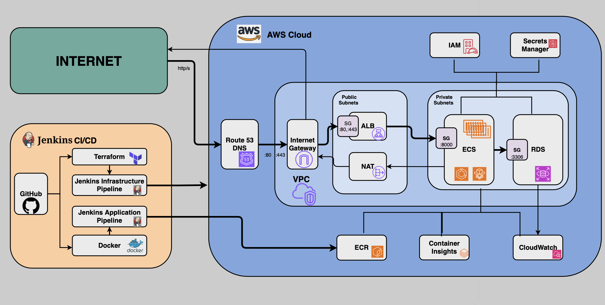

## Architecture Overview

The application consists of a PHP web application with MySQL database, deployed as a containerized microservice on AWS ECS with secure secrets management. It utilizes the popular LEMP stack(Linux, Nginx, MySQL, PHP)

Application is publically available at http://hello-world.stoycho.online

## AWS Architecure Diagram



### Components

- **Application**: PHP 8.2 web application with database connectivity
- **Database**: MySQL 8.0 with automated schema initialization
- **Infrastructure**: AWS ECS Fargate, RDS, ALB, VPC, SGs, Public/Private subnets, Route tables, NAT, Internet Gateway, IAM, Container Insights, CloudWatch.
- **Container Registry**: AWS ECR
- **Secrets Management**: AWS Secrets Manager
- **CI/CD**: Two separate Jenkins pipelines for infrastructure and application deployment
- **DNS**: Route53 for domain management

## Local Development Setup

### Prerequisites

- Docker and Docker Compose
- Git

### Running Locally

```bash
# Clone the repository
git clone https://github.com/stoychost/ProgressInterview
cd ProgressInterview

# Build the containers
docker compose build .

# Start the complete local environment
docker compose up -d

# Access the application
open http://localhost:8080
```

### Local Services

The docker compose setup provides:

- **PHP Application**: Port 8080 (via Nginx reverse proxy)
- **MySQL Database**: Port 3306 (internal)
- **phpMyAdmin**: Port 8081 for database administration
- **Nginx**: Reverse proxy and static file serving

### Local Configuration

Environment variables are managed through `.env` file:


# Normally the .env file would be included in .gitignore file for security reasons but here it's included so the app can run locally on other machines.


Key configuration:
- `APP_PORT`: External port for the application (default: 8080)
- `DB_PASSWORD`: Database password
- `MYSQL_ROOT_PASSWORD`: MySQL root password

## AWS Infrastructure

### Terraform Infrastructure Components

The Terraform configuration creates a complete AWS infrastructure:

#### Container Orchestration
- **ECS Cluster**: Fargate-based serverless container platform
- **ECS Service**: Manages desired count and deployment of application containers
- **Task Definition**: Container specifications with secrets integration
  - 256 CPU units (0.25 vCPU), 512 MB memory for free tier optimization
  - Network mode: awsvpc (each task gets own ENI in private subnet)
  - Integration with AWS Secrets Manager for database credentials# Hello World Microservice - Infrastructure and Deployment

#### Networking Components
- **VPC**: 10.0.0.0/16 CIDR block with DNS hostnames and resolution enabled
- **Internet Gateway (IGW)**: Provides internet access for public subnets
- **Public Subnets**: 2 subnets (10.0.1.0/24, 10.0.2.0/24) across availability zones
  - Hosts Application Load Balancer
  - Auto-assign public IP addresses
- **Private Subnets**: 2 subnets (10.0.10.0/24, 10.0.11.0/24) across availability zones
  - Hosts ECS Fargate tasks and RDS database
  - No direct internet access
- **NAT Gateway**: Single NAT Gateway in public subnet for outbound internet access
  - Enables private subnet resources to reach internet for updates
  - Uses Elastic IP for consistent outbound IP address
- **Route Tables**:
  - Public Route Table: Routes 0.0.0.0/0 to Internet Gateway
  - Private Route Table: Routes 0.0.0.0/0 to NAT Gateway
  - Subnet associations link subnets to appropriate route tables

#### Security Groups
- **ALB Security Group** (`aws_security_group.alb`):
  - Inbound: HTTP (80) and HTTPS (443) from anywhere (0.0.0.0/0)
  - Outbound: All traffic allowed
- **ECS Security Group** (`aws_security_group.ecs`):
  - Inbound: Port 8000 from ALB Security Group only
  - Outbound: All traffic allowed (for package downloads, AWS API calls)
- **RDS Security Group** (`aws_security_group.rds`):
  - Inbound: MySQL port 3306 from ECS Security Group only
  - No outbound rules (stateful connections handle responses)

#### IAM Security
- **ECS Task Execution Role**: Container lifecycle management and secrets retrieval
- **ECS Task Role**: Application runtime permissions (minimal/none required)

#### Load Balancing and Traffic Management
- **Application Load Balancer (ALB)**: Internet-facing load balancer in public subnets
  - Distributes traffic across ECS tasks in private subnets
  - Health checks on `/health` endpoint
  - Integration with Route53 for domain routing
- **Target Groups**: Manages ECS Fargate IP targets
  - Health check configuration: HTTP GET /health every 30 seconds
  - Healthy/unhealthy thresholds and timeout settings

#### Data
- **RDS MySQL**: Multi-AZ deployment in private subnets
- **ECR Repository**: Private container image registry
- **Secrets Manager**: Encrypted storage for database credentials

#### DNS and Monitoring
- **Route53**: Public hosted zone and DNS records
  - Hosted zone for domain management (stoycho.online)
  - A record pointing application domain to ALB
  - CNAME record for www subdomain (hello-world.)
  - Name servers for domain delegation
- **CloudWatch**: Comprehensive logging and monitoring
  - Log Groups: `/ecs/hello-world` for application logs
  - Container Insights: Enabled for detailed ECS cluster and service metrics
  - Custom metrics from application containers
  - Log retention policies for cost management
- **ECS Container Insights**: Advanced container monitoring
  - CPU, memory, network, and disk utilization metrics
  - Container-level performance data
  - Service and cluster-level aggregated metrics
  - Integration with CloudWatch dashboards
- **ALB Monitoring**: Built-in load balancer metrics and health checks

### Infrastructure as Code Structure

```
terraform/
├── main.tf          # Core infrastructure resources
├── variables.tf     # Input variables and validation
├── outputs.tf       # Resource outputs for pipeline integration
├── secrets.tf       # AWS Secrets Manager configuration
└── terraform.tfvars.example  # Template for variables
```

## Jenkins CI/CD Pipelines

The project uses two distinct Jenkins pipelines for infrastructure and application deployment. They get the source code from the GitHub repository and use local aws cli profile for authentication.

### Infrastructure Pipeline (Jenkinsfile.infrastructure)

Manages AWS infrastructure lifecycle through Terraform:

#### Pipeline Stages

1. **Checkout**: Git repository clone and branch selection
2. **Parameter Validation**: Safety checks for destructive operations
3. **Terraform Init**: Initialize providers and backend
4. **Terraform Plan**: Generate execution plan for changes
5. **Terraform Apply**: Apply infrastructure changes (conditional)
6. **Resource Discovery**: Export AWS resource information for app pipeline

#### Pipeline Parameters

- `TERRAFORM_ACTION`: Controls pipeline behavior
  - `plan`: Generate and display execution plan only
  - `apply`: Apply changes to infrastructure
  - `destroy`: Remove all infrastructure
- `FORCE_TERRAFORM`: Safety override for apply/destroy operations
- `GIT_BRANCH`: Target branch for deployment (default: main)

#### Key Features

- **Safety Mechanisms**: Requires explicit force flag for destructive operations
- **Resource Export**: Generates resource inventory for application pipeline
- **State Management**: Handles Terraform state conflicts and recovery
- **AWS Integration**: Direct API calls for resource discovery and validation

### Application Pipeline (Jenkinsfile.app)

Handles application deployment and container lifecycle:

#### Pipeline Stages

1. **Checkout**: Source code retrieval
2. **Load Infrastructure Resources**: Dynamic AWS resource discovery
3. **Build Docker Image**: Container image creation with build number tagging
4. **Push to ECR**: Upload images to AWS container registry
5. **Update ECS Service**: Deploy new task definition with secrets
6. **Wait for Deployment**: Monitor deployment completion
7. **Health Check**: Verify application functionality

#### Dynamic Resource Discovery

The application pipeline automatically discovers infrastructure resources:

```bash
# Example resource discovery
ALB_DNS_NAME=$(aws elbv2 describe-load-balancers --names hello-world-alb ...)
ECR_REPOSITORY_URL=$(aws ecr describe-repositories --repository-names hello-world-app ...)
ECS_CLUSTER_NAME=$(aws ecs describe-clusters --clusters hello-world-cluster ...)
```

This approach ensures:
- Infrastructure-agnostic deployment
- No hardcoded resource references
- Automatic adaptation to infrastructure changes
- Simplified pipeline maintenance

### Pipeline Integration

The pipelines work together through a resource export mechanism:

1. **Infrastructure Pipeline** creates AWS resources and exports their identifiers
2. **Application Pipeline** imports these identifiers dynamically
3. Both pipelines can run independently after initial infrastructure deployment
4. Resource discovery handles infrastructure changes automatically

## Security and Secrets Management

### AWS Secrets Manager Integration

Database credentials are managed through AWS Secrets Manager for enhanced security:

#### Secret Structure

```json
{
  "password": "auto-generated-secure-password",
  "username": "app_user", 
  "host": "database-endpoint",
  "port": 3306,
  "dbname": "hello_world"
}
```

#### ECS Integration

Secrets are injected into containers at runtime through ECS task definitions:

```json
{
  "secrets": [
    {
      "name": "DB_PASSWORD",
      "valueFrom": "arn:aws:secretsmanager:region:account:secret:hello-world-db-password:password::"
    }
  ]
}
```

#### Security Benefits

- **No Plaintext Storage**: Credentials never appear in code or configuration
- **Automatic Rotation**: Supports AWS automatic credential rotation
- **Audit Trail**: All secret access is logged in CloudTrail
- **Fine-grained Access**: IAM policies control secret access precisely
- **Encryption**: Secrets encrypted at rest and in transit

### IAM Security Model

#### Principle of Least Privilege

Each component has minimal required permissions:

- **ECS Task Execution Role**: Container lifecycle and secret retrieval only
- **ECS Task Role**: Application runtime permissions (none required currently)
- **Jenkins**: Infrastructure management and deployment permissions only

#### Secret Access Pattern

```
ECS Task Execution Role → Secrets Manager → Database Credentials → Application Container
```

The application container never has direct AWS API access for secrets - credentials are provided as environment variables by the ECS agent.

### Network Security Architecture

The infrastructure implements a multi-layer security model:

#### Network Isolation
- **VPC Isolation**: Complete network separation from other AWS accounts/resources
- **Private Subnets**: Application and database tiers isolated from direct internet access
- **Security Group Rules**: Stateful firewall rules implementing least privilege access
- **NAT Gateway**: Controlled outbound internet access for security updates only

#### Traffic Flow Security
```
Internet → IGW → ALB (Public Subnets) → ECS Tasks (Private Subnets) → RDS (Private Subnets)
```

#### Security Group Chain
- External traffic only reaches ALB on ports 80/443
- ALB can only communicate with ECS tasks on port 8000
- ECS tasks can only reach RDS on port 3306
- No direct database access from internet or ALB

### Container Security

- **Non-root User**: Application runs as unprivileged user in container
- **Minimal Base Image**: Alpine Linux for reduced attack surface
- **Health Checks**: Automated container health monitoring
- **Resource Limits**: CPU and memory constraints prevent resource exhaustion

## Deployment Process

### Initial Infrastructure Deployment

```bash
# 1. Configure infrastructure variables
cp terraform/terraform.tfvars.example terraform/terraform.tfvars
# Edit terraform.tfvars with your settings

# 2. Run infrastructure pipeline
# In Jenkins: hello-world-infrastructure
# Parameters: TERRAFORM_ACTION=plan, FORCE_TERRAFORM=false

# 3. Review plan and apply
# Parameters: TERRAFORM_ACTION=apply, FORCE_TERRAFORM=true
```

### Application Deployment

```bash
# 1. Ensure Docker is running locally for image builds

# 2. Run application pipeline  
# In Jenkins: hello-world-app-deployment
# Pipeline automatically discovers infrastructure and deploys

# 3. Verify deployment
curl http://hello-world.stoycho.online/health
```

### Update Workflows

**Infrastructure Changes**:
1. Modify Terraform configuration
2. Commit changes to repository
3. Run infrastructure pipeline with `plan` action
4. Review changes and apply with `apply` action

**Application Changes**:
1. Modify application code
2. Commit changes to repository
3. Run application pipeline (automatic build and deployment)

## Monitoring and Troubleshooting

### Application Monitoring

- **Health Endpoint**: `/health` provides application status and environment details
- **CloudWatch Logs**: Centralized application logging with structured log format
- **ECS Container Insights**: Detailed container performance metrics
  - CPU and memory utilization per container and service
  - Network metrics and disk I/O statistics
  - Container restart and failure tracking
- **ALB Health Checks**: Automatic unhealthy instance replacement
- **ECS Service Events**: Deployment and scaling history
- **CloudWatch Dashboards**: Visual monitoring of infrastructure and application metrics

### Common Troubleshooting

**Database Connection Issues**:
```bash
# Check secret availability
aws secretsmanager get-secret-value --secret-id hello-world-db-password

# Verify ECS task logs
aws logs tail /ecs/hello-world --follow
```

**Infrastructure Issues**:
```bash
# Check Terraform state
terraform state list
terraform show

# Verify AWS resources
aws ecs describe-services --cluster hello-world-cluster --services hello-world-service
```


## Maintenance

### Regular Tasks

- **Security Updates**: Monitor and apply container base image updates
- **Credential Rotation**: Enable AWS automatic rotation for database credentials  
- **Log Cleanup**: Configure CloudWatch log retention policies
- **Infrastructure Updates**: Keep Terraform providers updated

### Backup and Recovery

- **Database**: Automated RDS backups with 7-day retention
- **Configuration**: All infrastructure defined in version-controlled code
- **Container Images**: Tagged and stored in ECR with lifecycle policies

## Development Guidelines

### Local Development

1. Use docker-compose for complete local environment
2. Test changes locally before committing
3. Follow branch naming conventions for pipeline integration

### Infrastructure Changes

1. Always run `terraform plan` before applying changes
2. Use meaningful commit messages for infrastructure changes
3. Test infrastructure changes in non-production environments first

### Application Changes

1. Ensure Docker builds succeed locally
2. Test health endpoints before deployment
3. Monitor CloudWatch logs after deployment

## Future enhancements

1. Apply SSL certificate
2. Implement rules for autoscaling based on different conditions.
3. Enhance monitoring with third party tools.